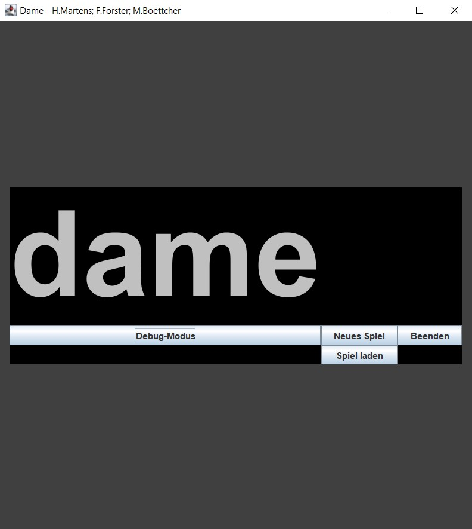
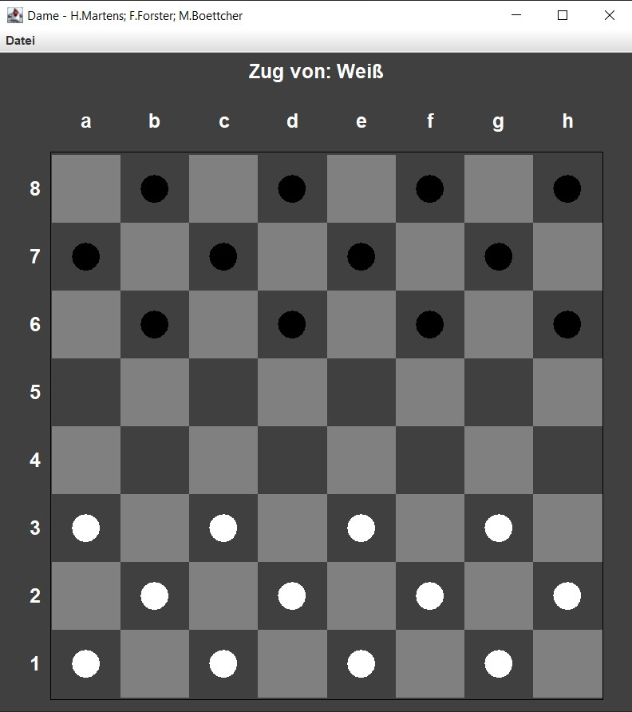

# ⚫ ⚪ Dame-Spiel

Das Spiel ‚Checkers‘ für zwei Spieler mit einem zusätzlichen Modus zur freien Brettgestaltung - mit grafischer Benutzeroberfläche (Swing).

---

## 🚀 Features

- das Spiel „Checkers“ für zwei Spieler
- Modus zur freien Gestaltung des Spielbretts (freie Platzierung der Spielsteine, Debug-Modus)
- Spiel im txt-Format speichern
- übersichtlicher Code gemäß mvc

---

## 📷 Screenshots

---

## 🛠️ Verwendete Technologien

| Tool / Library                               | Zweck                 |
|----------------------------------------------|-----------------------|
| Java (11+), getestet mit Temurin JDK 11.0.23 | Programmiersprache    |
| Swing                                        | GUI-Toolkit           |
| Maven (3.6+)                                 | Dependency-Management |

---

## 💻 Installation/Ausführung

Voraussetzungen:
- Java JDK **11** oder neuer
- Maven 3.6 oder neuer

### Mit IDE (Intellij)

1. Projekt klonen: `git clone https://github.com/Hannes2806/Dame.git`
2. Öffnen in der IDE
3. `Main.java` ausführen

## 📄 Lizenz

Dieses Projekt steht unter der Apache License 2.0. Weitere Informationen siehe [LICENSE](LICENSE.txt).

## Autor

Hannes F. Martens,
Matthes Boettcher,
Farin Forster