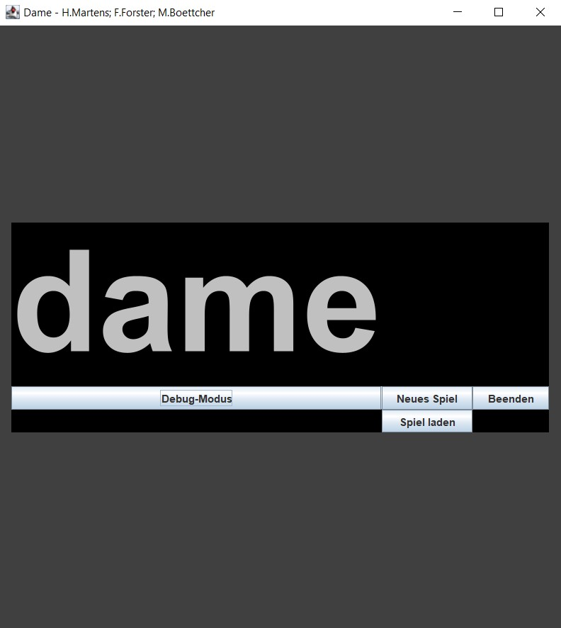
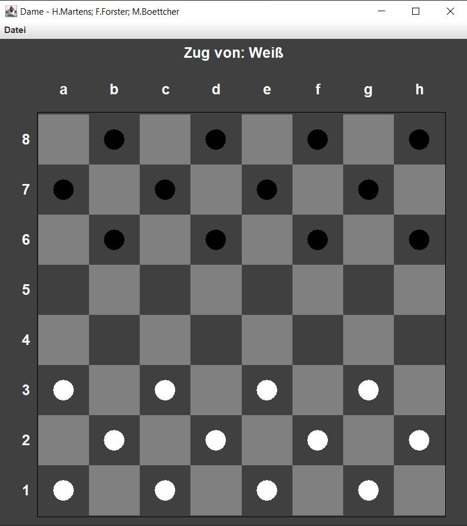
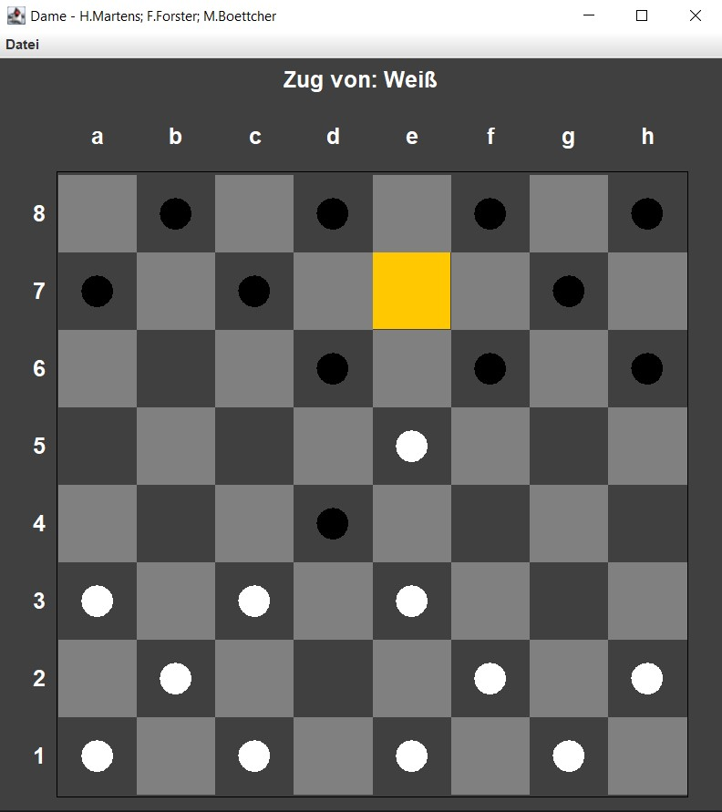
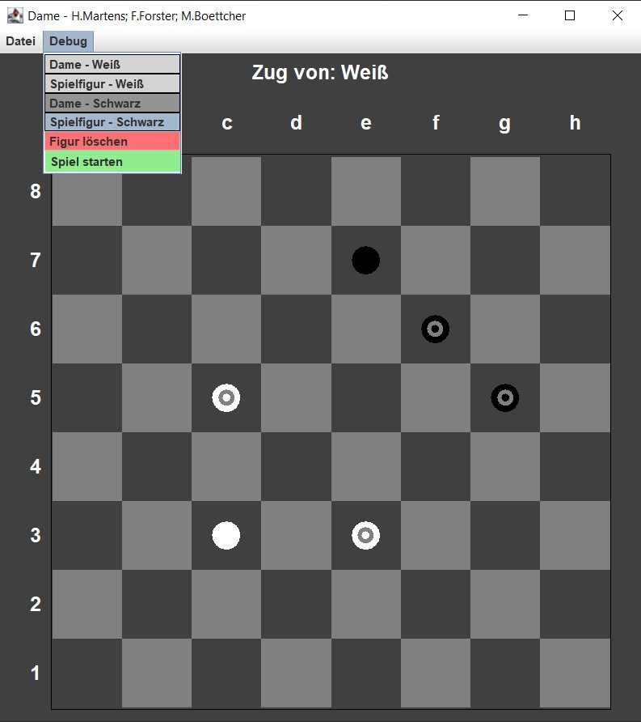

# ⚫ ⚪ Checkers

The game ‘Checkers’ for two players with an additional mode for free board design - with graphical user interface (Swing). 

---

## 🚀 Features

- the game ‘Checkers’ for two players
- mode for free board design (free placement of game pieces, debug mode)
- save game in txt format
- clear code according to mvc

---

## 📷 Screenshots

---

## 🛠️ Used technologies

| Tool / Library                                                   | Purpose               |
|------------------------------------------------------------------|-----------------------|
| Java (11+), tested with Temurin JDK 11.0.23                      | Programming language  |
| Swing                                                            | GUI-Toolkit           |
| Maven (3.6+)                                                     | Dependency-Management |

---

## 💻 Installation/Execution

Requirements:
- Java JDK **11** or later
- Maven 3.6 or later

### With IDE (Intellij)

1. Clone project: `git clone https://github.com/Hannes2806/Dame.git
2. Open in IDE (Intellij)
3. Execute `Main.java`

## 📄 Licence

This project is licensed under the Apache Licence 2.0. For more information see [LICENSE](LICENSE.txt).

## Author

Hannes F. Martens, 
Matthes Boettcher,
Farin Forster